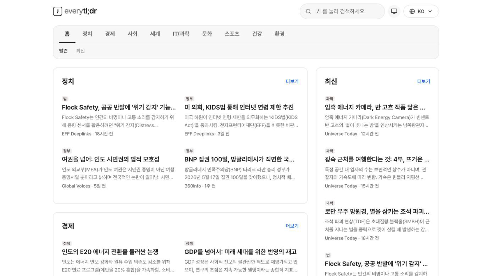
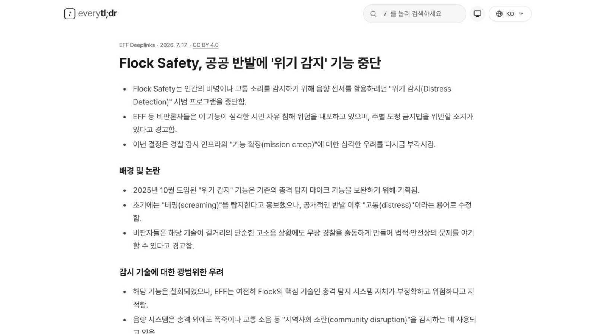
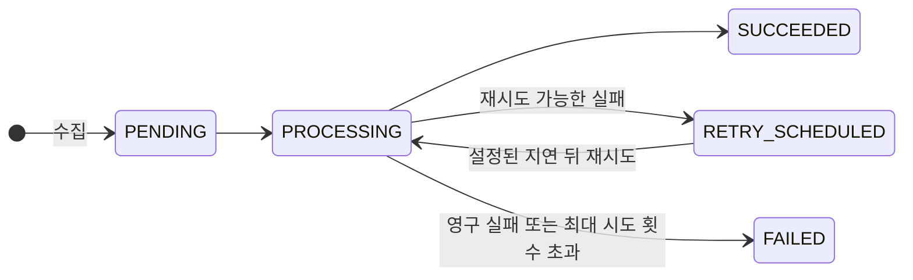

# everytldr

해외 뉴스를 읽기 좋은 길이로 요약해 한국어와 영어로 보여주는 뉴스 서비스입니다.

**Live** → [everytldr.com](https://everytldr.com)

| 홈 피드 | 기사 상세 |
| --- | --- |
|  |  |

## 주요 기능

- 해외 매체 기사를 한국어/영어 요약으로 읽을 수 있습니다.
- 정치, 경제, IT 같은 카테고리로 나눠 훑어보고, 요약 본문을 검색할 수 있습니다.
- 로그인 없이 좋아요를 누르고 대댓글을 달 수 있습니다.
- 모든 요약에 원문 링크와 출처를 함께 표시합니다.
- 언어·카테고리별 RSS 피드를 제공합니다.

## 동작 방식

새 기사를 가져오는 일(수집)과 요약을 만드는 일(요약)을 두 단계로 나눠 처리합니다.

수집 단계는 각 매체의 RSS 피드를 주기적으로 확인해 새 기사의 메타데이터를 저장하고, "요약 대기" 작업을 하나 만들어 둡니다. 요약 단계는 대기 중인 작업을 가져와 기사 본문을 크롤링한 뒤, Gemini로 한국어·영어 제목과 요약을 만들고 카테고리를 정합니다.

둘을 나눈 이유는 AI 쪽에 문제가 생겨도 기사 수집이 멈추지 않게 하기 위해서입니다. 수집 단계는 AI를 호출하지 않으니 장애와 무관하게 기사가 계속 쌓이고, 실패는 요약 단계에서만 생기니 그 작업만 다시 돌리면 됩니다. 같은 기사가 두 번 저장되는 일은 원문 URL 해시에 걸어 둔 UNIQUE 제약이 DB 차원에서 막아줍니다.

재시도 가능한 실패는 시도 횟수와 에러 내용을 남기고 설정된 지연 뒤 다시 처리합니다. 잘못된 AI 출력, 지원하지 않는 원문 URL처럼 영구적인 실패는 바로 실패 상태로 남깁니다. 프로세스가 죽어서 처리 중인 채로 멈춘 작업도 남은 시도 횟수가 있으면 일정 시간이 지난 뒤 회수해 다시 시도합니다. 카테고리는 AI가 마음대로 새 분류를 만들지 못하도록 DB에 미리 넣어 둔 목록 안에서만 고르게 했습니다.

## 기술적 의사결정

### API 계약 자동화

백엔드가 저장소 루트의 `docs/openapi.json` 스펙을 생성해 커밋하고, 프론트엔드는 orval이 이 스펙에서 TypeScript 타입과 API 훅을 만들어 씁니다. `main`과 `develop` push에서는 CI가 스펙을 다시 생성해 커밋본과 비교합니다. API를 바꾸면 스펙도 함께 갱신해 프론트와 백엔드의 타입이 어긋난 채 배포되는 일을 막습니다.

### Snowflake ID

서비스 도메인 엔티티의 ID는 시간 정보가 들어간 64-bit Snowflake 방식으로 애플리케이션에서 직접 발급합니다. 생성 시각은 ID에서 복원하므로 `created_at` 컬럼을 따로 두지 않습니다. 기사 목록은 발행 시각(`publishedAt`)과 동률을 해소하는 ID를 함께 사용해 최신순 커서 페이지네이션을 구현합니다. 초기 데이터는 예약된 발급 번호로 ID를 만들어 런타임 발급분과 충돌하지 않게 했습니다.

### Redis 조회수 집계

조회수는 Redis에서 익명 방문자별 중복을 제한해 먼저 집계하고, `scheduler` 프로필이 주기적으로 DB에 반영합니다. 조회수 반영 이력도 함께 정리해 Redis의 빠른 집계와 MySQL의 영속된 수치를 함께 유지합니다.

### Soft delete

데이터를 실제로 지우는 대신 삭제 시각만 기록하고 조회할 때 걸러냅니다. Hibernate가 제공하는 `@SoftDelete`는 연관 관계 로딩에 제약이 있어서, 쿼리에 조건을 거는 `@SQLRestriction` 방식을 택했습니다. 덕분에 부모 댓글이 지워져도 대댓글은 남고, 부모 자리에는 삭제된 댓글이라는 표시만 나옵니다.

### 프론트엔드 구조를 린트로 강제

프론트엔드 폴더 구조는 Feature-Sliced Design을 따릅니다. 이런 규칙은 문서로만 두면 결국 무너지기 때문에, 레이어를 잘못 가로지르는 임포트를 린터(steiger)가 개발 중과 빌드에서 바로 잡아내게 했습니다.

### 테스트는 진짜 MySQL로

테스트용 인메모리 DB(H2)를 쓰지 않고 프로덕션과 같은 MySQL 8 컨테이너에서 테스트를 돌립니다. DB가 달라서 테스트에서만 통과하는 상황을 없애는 게 목적이고, 대신 느려지는 테스트 부팅은 컨테이너 재사용과 테스트별 롤백으로 줄였습니다.

### 원본 IP는 저장하지 않음

로그인이 없는 서비스라 좋아요 중복과 댓글 어뷰징을 IP로 구분해야 하는데, 원본 IP 대신 해시값만 저장합니다. 댓글 옆에 보이는 IP도 마스킹된 표시용 값이라 원본 IP는 서버 어디에도 남지 않습니다.

## 레포지토리 구조

- [`frontend/`](frontend/README.md) — Next.js 앱. 실행 방법과 기술 스택은 문서 참고
- [`backend/`](backend/README.md) — Spring Boot 서버. 실행 방법과 기술 스택은 문서 참고
- `infra/` — 단일 호스트 docker-compose 배포 구성
- `docs/` — PRD, 엔티티 설계, OpenAPI 스펙

## 설계 문서

- [PRD](docs/PRD.md) — 제품 요구사항과 스코프
- [엔티티 설계](docs/ENTITY_DESIGN.md) — 영속성 레이어 설계와 결정 근거
- [디자인 시스템](frontend/DESIGN.md) — 프론트엔드 디자인 토큰과 규칙
